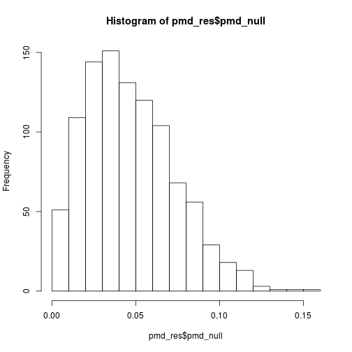

# Introduction

Percent Maximum Difference provides a metric that enables the measurement of how similar (PMD near 0) or different (PMD near 1) two batches are based just on clustering results. This can be viewed as an alternative to a Chi-squared type analysis based on a contingency table in which the batches are noted in columns, and the abundance of cells in each cluster is noted in rows. PMD advances on Chi-squared and Fishers exact tests because its results are actually not dependent on the number of clusters found. It does this by first calculating the hypothetical maximum possible asymmetry between your batches. (i.e.: if each batch was only comprised of clusters that only ever appeared in that batch and there were no clusters that appeared in more than one batch). Then it calculates the observed asymmetry in your real results, then returning the percentage of the observed asymmetry relative to the maximum possible asymmetry. This gives a lower bound of zero, where the relative abundance of each cluster was spot-on the same between all of the batches. This also gives an upper bound of one, in which the observed clustering results were fully asymmetric across batch; or in other words, each cluster was fully batch specific.


# Installation

`devtools::install_github('scottyler89/PercentMaxDiff')`

Although, this package has also been submitted to Bioconductor; we'll update this section once it's accpeted there!


# Examples
## Running PMD on batch/clustering results


```r
library("PercentMaxDiff")
## generate a vector that represents batch
batch <- rep(seq_len(2),each=100)
## generate a vector that represents clusters
clusters <- rep(rep(seq_len(2),each=50),2)
## run pmd
pmd_res <- pmd(batch, clusters)
```

You can also run it on more than two batches! It actually works in n-dimentions both for batches or clusters.


```r
## generate a vector that represents batch
batch <- rep(seq_len(3),each=100)
## generate a vector that represents clusters
clusters <- rep(rep(seq_len(2),each=50),3)
## run pmd
pmd_res <- pmd(batch, clusters)
```

## Looking at the PMD results

The resultant object is a list with several useful metrics that describe how similar batches are to each other based on their clustering results.

* _*cont_table*_ : The contingency table of clusters (rows) and batches (columns)

* _*expected*_ : The expected matrix, as with a Chi-square test.

*  _*pmd_null*_ : Simulations of the null distribution of PMDs using the observed global percentage of cluster abundances across all batches with the observed batch sizes to match the input. Note that this will approach zero, but due to random sampling, typically will never actually get there. That's what makes having this null background useful.

* _*pmd_null_lambda*_ : The lambda value of the null distributions Poisson fit. 

* _*p.value*_ : Significance for whether or not batches are different in their cellular composition. This is determined through the generating *num_sim* null distributions, and emperically measuring the number of times the observed PMD was greater than the PMDs generated from the null distribution. Low p-values indicate that the batches are indeed different from each other.

* _*pmd*_ : The percent maximum difference (pmd) of the input dataset.


## Looking at significance

Part of the pmd function is running a null background. This mimics the numbers and relative abundnance of your input data, but under the null-hypothesis that your batches were not actually different. These simulations yield a vector of null pmd calculations. You can look at that like so:


```r
hist(pmd_res$pmd_null, breaks = 15, main = paste("lambda:", pmd_res$pmd_null_lambda))
```



Using this null background, an empirical p-value is calculated:


```r
pmd_res$p.value
```

```
## [1] 0.998
```

## comparing two different 'batch correction' or normalization approaches

Lets say you had done batch integration & clustering using two different algoirthms. There were three datasets - two were very similar, and one was very different. 


```r
batch <- rep(seq_len(3),each=1000)
clust<- c(rep(seq_len(4),each=250),rep(seq_len(4),each=250))
clust<- c(clust, c(rep(seq_len(4),each=250)+4))
```

Let's take a look at what that looks like


```r
unique(cbind(batch, clust))
```

```
##       batch clust
##  [1,]     1     1
##  [2,]     1     2
##  [3,]     1     3
##  [4,]     1     4
##  [5,]     2     1
##  [6,]     2     2
##  [7,]     2     3
##  [8,]     2     4
##  [9,]     3     5
## [10,]     3     6
## [11,]     3     7
## [12,]     3     8
```

So this is a situation where we had three batches, 4 clusters that appeared in batches 1 and 2 evenly, but batch 3 had 4 clusters that were specific to it, and had none of the clusters that appear in the first two batches.

Let's run the PMD on it to quantify how similar these batches are overall.


```r
## This will take a few seconds because of the simulations.
pmd_res_3_perfect <- pmd(batch, clust)
pmd_res_3_perfect$pmd_raw
```

```
## [1] 0.6666667
```

```r
pmd_res_3_perfect$pmd
```

```
## [1] 0.6528314
```

```r
pmd_res_3_perfect$p.value
```

```
## [1] 0.001
```

The Raw PMD in this case is 0.66667. That's because exactly 2/3rds of the cells come from clusters that are shared across batches, while the remaining 1/3rd is from batch 3 that was completely different from the others. The P-value is 0 (or in this case just more significant that the 1000 null simulations run in which there was no pattern by batch).

Because of random Poisson sampling, there is a background level of noise that needs to be corrected for. That's why the final pmd value is actually slightly less than 2/3rds.

Let's see what it would look like in a more realistic scenario using the \code{get_random_sample_cluster} function.


```r
## generate the random cluster labels based on the probability vectors fed into the first argument
batch_size <- 500
batch1_clusters <- get_random_sample_cluster(c(rep(.25,4),rep(0,4)),batch_size)
batch2_clusters <- get_random_sample_cluster(c(rep(.25,4),rep(0,4)),batch_size)
batch3_clusters <- get_random_sample_cluster(c(rep(0,4),rep(.25,4)),batch_size)
## make the batch labels
batch1_labels <- rep("batch1",batch_size)
batch2_labels <- rep("batch2",batch_size)
batch3_labels <- rep("batch3",batch_size)
## collate the final batch and cluster vectors
realistic_batch <- c(batch1_labels,
                     batch2_labels,
                     batch3_labels)
realistic_clust <- c(batch1_clusters,
                     batch2_clusters,
                     batch3_clusters)
# run the pmd function!
pmd_res_3_realistic <- pmd(realistic_batch, realistic_clust)
pmd_res_3_realistic$pmd_raw
```

```
## [1] 0.6666667
```

```r
pmd_res_3_realistic$pmd
```

```
## [1] 0.6467351
```

```r
pmd_res_3_realistic$p.value
```

```
## [1] 0.001
```

You can also run a post-hoc analysis of the main result:


```r
## first using batch and cluster labels
batch_labels <- paste("batch",rep(seq_len(3),each=100))
cluster_labels <- paste("cluster",c(rep(rep(seq_len(2),each=50),2),rep(seq_len(2),each=50)+1))
pmd_res <- pmd(batch_labels, cluster_labels)
## This is what the cluster/batch contingency table looks like:
print(pmd_res$cont_table)
```

```
##           batch 1 batch 2 batch 3
## cluster 1      50      50       0
## cluster 2      50      50      50
## cluster 3       0       0      50
```

```r
## Which makes the percent maximum difference ~ 1/3rd
print(pmd_res$pmd_raw)
```

```
## [1] 0.3333333
```

```r
## in a real-world sceanrio, the data wouldn't be this clean beacuse of noise via
## Poisson sampling so the corrected PMD is actually a bit lower:
print(pmd_res$pmd)
```

```
## [1] 0.2853774
```

```r
## Using the pmd_posthoc function, we'll be able to figure out exactly which batch(es) 
## are causing the 1/3rd asymmetry
pmd_pairwise <- pmd_posthoc(pmd_res)
```

```
## [1] "batch 1" "batch 2"
## [1] "batch 1" "batch 3"
## [1] "batch 2" "batch 3"
```

```r
print(pmd_pairwise)
```

```
## $pmd_raw_table
##         batch 1 batch 2 batch 3
## batch 1     0.0     0.0     0.5
## batch 2     0.0     0.0     0.5
## batch 3     0.5     0.5     0.0
## 
## $pmd_table
##             batch 1     batch 2   batch 3
## batch 1  0.00000000 -0.06149225 0.4576536
## batch 2 -0.06149225  0.00000000 0.4586401
## batch 3  0.45765359  0.45864010 0.0000000
## 
## $p.value_table
##         batch 1 batch 2 batch 3
## batch 1   1.000   0.963   0.001
## batch 2   0.963   1.000   0.001
## batch 3   0.001   0.001   1.000
## 
## $p.value_table_adjusted
##         batch 1 batch 2 batch 3
## batch 1 1.00000 1.00000 0.00225
## batch 2 1.00000 1.00000 0.00225
## batch 3 0.00225 0.00225 1.00000
```

```r
## looking at the pmd_pairwise$pmd_raw_table, we can clearly see that batch 3 is half different from both batches 1 and 2.
print(pmd_pairwise$pmd_raw_table)
```

```
##         batch 1 batch 2 batch 3
## batch 1     0.0     0.0     0.5
## batch 2     0.0     0.0     0.5
## batch 3     0.5     0.5     0.0
```

```r
## similar to above, because in a real-world example the data wouldn't be so clean, the adjusted PMDs are a bit lower
print(pmd_pairwise$pmd_table)
```

```
##             batch 1     batch 2   batch 3
## batch 1  0.00000000 -0.06149225 0.4576536
## batch 2 -0.06149225  0.00000000 0.4586401
## batch 3  0.45765359  0.45864010 0.0000000
```

```r
## Now if we look at the pairwise p-values, we see that batch3 is the clear outlier and batches 1 and 2 are very similar
print(pmd_pairwise$p.value_table)
```

```
##         batch 1 batch 2 batch 3
## batch 1   1.000   0.963   0.001
## batch 2   0.963   1.000   0.001
## batch 3   0.001   0.001   1.000
```

```r
## The above are the nominal p-values. Below are the adjusted p-values (BH correction by default)
print(pmd_pairwise$p.value_table_adjusted)
```

```
##         batch 1 batch 2 batch 3
## batch 1 1.00000 1.00000 0.00225
## batch 2 1.00000 1.00000 0.00225
## batch 3 0.00225 0.00225 1.00000
```


